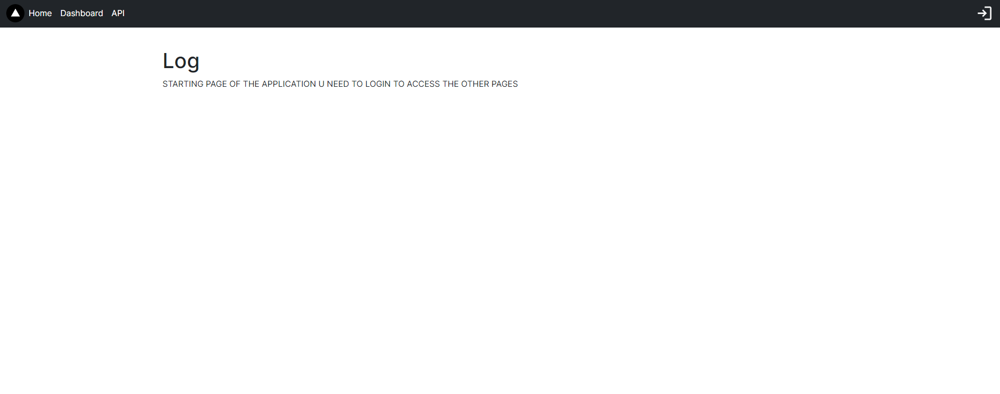
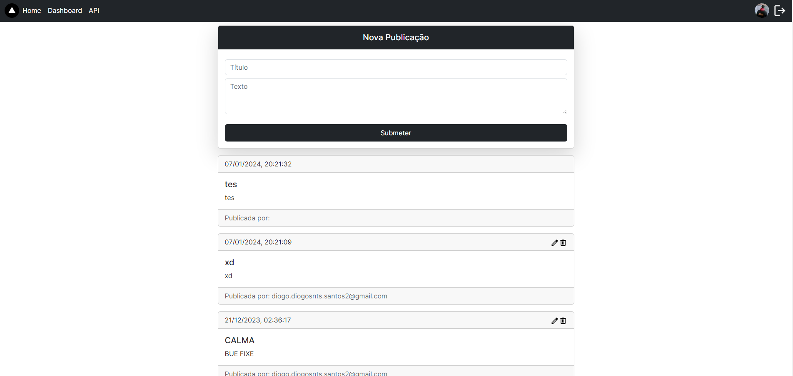
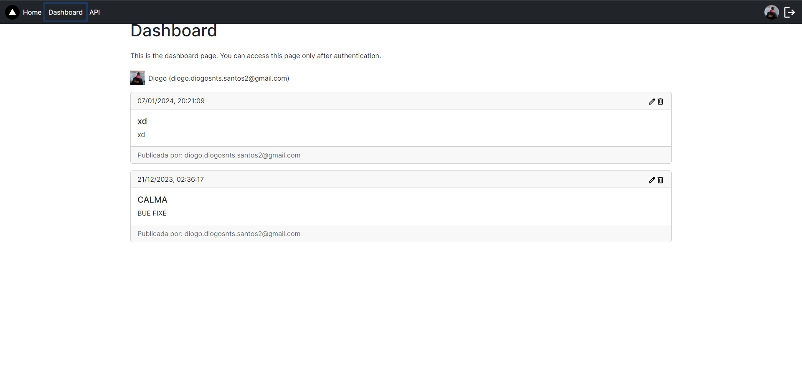

# BLOG MODEL
É um projeto pessoal que consiste em fazer um modelo de uma WEBSite de Blogs, onde qualquer utilizador pode fazer a sua publicação.

Primeiramente este projeto vai conter:
* imprimir todas as publicações
* editar as publicações
* remover as publicações
E no futuro vai poder ter uma conta utilizador com a sua dashboard onde ele pode editar os seus dados ect e podendo so editar e remover as suas publicações. E comentar as publicações.


A classe publicações vai ter os seguintes atributos:
* ID_pub - id da publicacao
* data_pub - data de quando foi criado / de quando foi editado
* title_pub - titlo da pub (45car)
* text_pub - conteudo da pub (300car)
* email_user - vai buscar o email do utilizador que estiver iniciado 
* edit_pub (0/1) - 0 se nao foi editado e 1 se foi editado 


## Criar database

Criar base de dados:
```sql
CREATE DATABASE blogmodel;
```
Tabela usada para guardar as publicações
```sql
CREATE TABLE `pub` (
  `ID_pub` int NOT NULL AUTO_INCREMENT,
  `data_pub` datetime DEFAULT NULL,
  `title_pub` varchar(45) DEFAULT NULL,
  `text_pub` varchar(300) DEFAULT NULL,
  `email_user` varchar(45) DEFAULT NULL,
  `edit_pub` int(1) unsigned zerofill DEFAULT NULL,
  PRIMARY KEY (`ID_pub`),
  UNIQUE KEY `ID_pub_UNIQUE` (`ID_pub`)
) ENGINE=InnoDB AUTO_INCREMENT=1 DEFAULT CHARSET=utf8mb4 COLLATE=utf8mb4_0900_ai_ci
```
## Layout

Quando se abre a pagina teria a "Loading screen" e ao entrar na pagina inicial ia ter a barra de navegação com uma imagem.
E por baixo dessa imagem seria exposto todas as publicações da mais recentes para mais antigas. 


### Feito
* Botão para apagar ou alterar cada publicação
* User entram com github
* cada usar so pode modificar/apagar as suas publicacoes
* adicionado o botao de login
* "Loading Screen" - Não está personalizado
* Melhorar dashboard

## Preview
### Start

### Home


### DashBoard


----

## Getting Started

First, run the development server:

```bash
npm run dev
# or
yarn dev
# or
pnpm dev
# or
bun dev
```

Open [http://localhost:3000](http://localhost:3000) with your browser to see the result.
