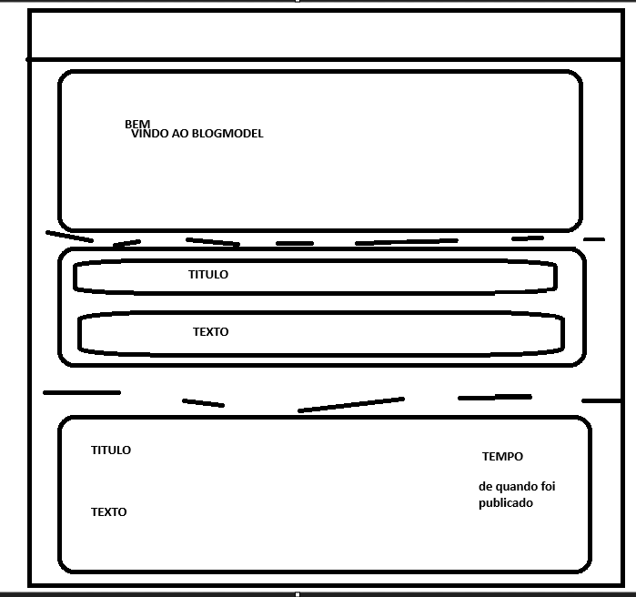

# BLOG MODEL
É um projeto pessoal que consiste em fazer um modelo de uma WEBSite de Blogs, onde qualquer utilizador pode fazer a sua publicação.

Primeiramente este projeto vai conter:
* imprimir todas as publicações
* editar as publicações
* remover as publicações
E no futuro vai poder ter uma conta utilizador com a sua dashboard onde ele pode editar os seus dados ect e podendo so editar e remover as suas publicações. E comentar as publicações.


A classe publicações vai ter os seguintes atributos:
* ID_pub - id da publicacao
* data_pub - data de quando foi criado / de quando foi editado
* title_pub - titlo da pub (45car)
* text_pub - conteudo da pub (300car)
* ID_user - inicialmente com 0 mas no futuro seria o id_user que criou a publicacao
* edit_pub (0/1) - 0 se nao foi editado e 1 se foi editado 


## Layout

Quando se abre a pagina teria a "Loading screen" e ao entrar na pagina inicial ia ter a barra de navegação com uma imagem.
E por baixo dessa imagem seria exposto todas as publicações da mais recentes para mais antigas. 



### Feito
* Botão para apagar ou alterar cada publicação

### LOGIN 
NEXT AUTH -> session.user -> image, name, email
agora falta mandar isto para uma base de dados para assim termos ID.user

### Para fazer
* Loading Screen
* Versão 0.7: 
  * Adicionar users, o seu perfil para verem as suas publicações e alterar os seus dados [ USAR NEXT JS AUTH]
  * cada um apaga/edita so a sua publicacao 
  * adicionar o botao de login

----

This is a [Next.js](https://nextjs.org/) project bootstrapped with [`create-next-app`](https://github.com/vercel/next.js/tree/canary/packages/create-next-app).

## Getting Started

First, run the development server:

```bash
npm run dev
# or
yarn dev
# or
pnpm dev
# or
bun dev
```

Open [http://localhost:3000](http://localhost:3000) with your browser to see the result.

You can start editing the page by modifying `app/page.js`. The page auto-updates as you edit the file.

This project uses [`next/font`](https://nextjs.org/docs/basic-features/font-optimization) to automatically optimize and load Inter, a custom Google Font.

## Learn More

To learn more about Next.js, take a look at the following resources:

- [Next.js Documentation](https://nextjs.org/docs) - learn about Next.js features and API.
- [Learn Next.js](https://nextjs.org/learn) - an interactive Next.js tutorial.

You can check out [the Next.js GitHub repository](https://github.com/vercel/next.js/) - your feedback and contributions are welcome!

## Deploy on Vercel

The easiest way to deploy your Next.js app is to use the [Vercel Platform](https://vercel.com/new?utm_medium=default-template&filter=next.js&utm_source=create-next-app&utm_campaign=create-next-app-readme) from the creators of Next.js.

Check out our [Next.js deployment documentation](https://nextjs.org/docs/deployment) for more details.
